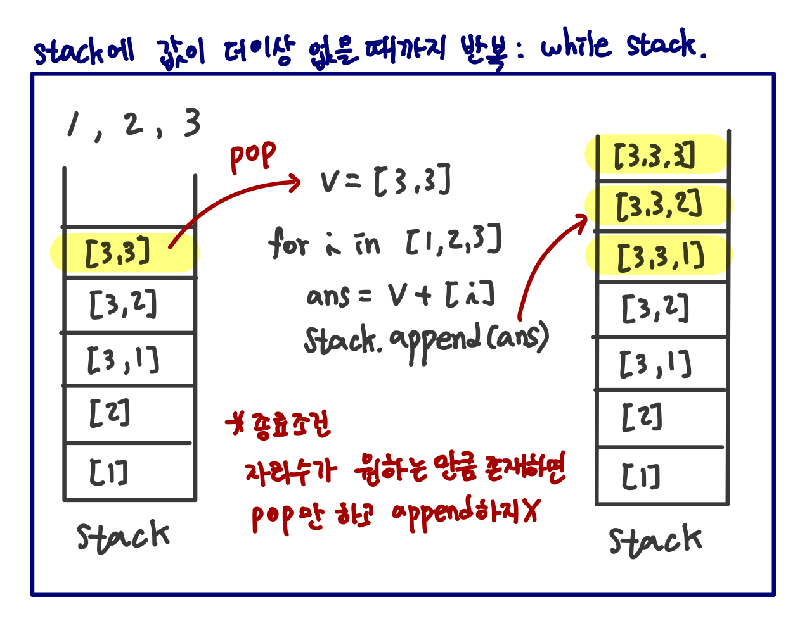

# Algorithm study

## 1. 자료 구조

### 1.1 Stack

#### 1.1.1 dfs 📌

- 동작 원리

  

### 1.2 Queue

#### 1.2.1 BFS

- 사용 목적
  - **미로, 특정위치/조건까지의 거리/ 단계 수 등 한 단계씩 탐색하면서 답을 찾는 경우**
  - 기본적으로 **각 단계 진행에 필요한 비용이 동일한 경우**에 중복 방문을 방지하면서 진행
  - 경우에 따라 조건에 따른 중복 방문을 허용하면서 진행하는 경우도 있다.

- BFS로 접근하지 않는 경우는?
  - 시간 복잡도 => N = 1000이어서 N*N = 1000000일 때