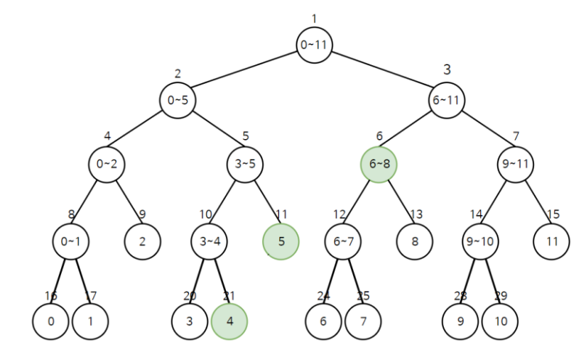

# B형 대비 (C++)

## 0. Pro 빈출 알고리즘

> 1. **Segment Tree** 
> 2. **Dijkstra** 
> 3. **Priority Queue**
> 4. **Union Find**
> 5. **MST**


## 1. 시간복잡도

```
O(N) : N이 1억(100,000,000)일 때, 1초 걸린다.
O(N^2) : N이 10,000일 때, 1초가 걸린다.
O(N^3) : N이 1000일 때, 10초가 걸린다.
O(NlogN) :

BFS의 시간복잡도는 O(노드개수)
```


## 2. C++ 시작

### 2.1. Build Test

```c++
#include<iostream>
using namespace std; 

int main()
{
    // cin, cout 속도를 빠르게 해준다.
  	ios::sync_with_stdio(false); 
	cin.tie(0); 
	cout.tie(0); 

	cout << "Hi" << "\n";
    
	return 0; 
}
```

- `cin`, `cout`은 그대로 쓰면 속도가 느리므로, 위의 명령어를 추가해준다.
- 이때, `cout`에서 `endl`을 쓰지 않고 `"\n"`을 써야한다.


### 2.2. 파일 입출력

```c++
#define _CRT_SECURE_NO_WARNINGS			// 일부 버전에 안전성의 문제로 warning을 발생시키므로
#include <iostream>

using namespace std;

int main() {
	ios::sync_with_stdio(false);
	cin.tie(0);
	cout.tie(0);

	freopen_s(new FILE*, "input.txt", "r", stdin);
}
```

- `input`은 `리소스 파일`에 `"input.txt"`로 저장하고 사용한다.
- 추가해준 코드 2줄은 답안 제출시 주석 처리 해야한다.


### 2.3. 디버그 단축키

```
// 단축키
break point 
vs : F9 (라인에 커서 위치한 채로)

// 디버그
vs: F5

// step over (한 줄을 실행한다. 함수를 한번에 실행 후, 다음으로 넘어간다.) 
vs : F10

// resume (디버그로 한 줄 한 줄 실행시키는 트레이스 모드를 그만두고 다음 브레이크 포인트를 만날 때까지 실행한다.)
vs : F5

// terminate
vs : shift + F5

// step into (함수 내부로 들어간다.) 
vs : F11
eclipse : F5

// step return (함수 리턴 시키기)
vs : shift + F11 
```


## 3. C++ 문법 Tip!

### 3.1 동적 배열

```c++
// arr의 인덱스 하나하나가 vector
vector<int> arr[100];

// arr[0] = {1, 2, 3}
// arr[1] = {0, 3}
// arr[2] = {9}
```

```c++
#include<iostream>
#include<vector>


int main() {
    vector<int> arr[10];
    for (int i = 0; i < 10; i++) {
        cin >> from >> to;
        arr[from].push_back(to);
    }
}
```

- `vector`에 원소를 넣기 위해서는 `push_back`을 사용한다.


```c++
// arr 자체가 vector
vector<int> arr(N);

// arr = {1, 3, 5, 2}
```


### 3.2 for each문

```c++
#include<iostream>
#include<vector>


int main() {
    vector<int> arr = {1, 2, 4,5}; 
    for (int i; arr) {
        cout << i << "\n";
    }
}
```


### 3.3 배열 초기화


## 4. Binary Search

### 4.1. 기초 코드(중복X)

```c++
#include <iostream>

using namespace std;

int arr[8] = { 0, 3, 4, 6, 7, 9, 11, 17 };

int binary_search(int finding) {
	int s = 0;
	int e = 8;			// e = arr.size()
	int ans;

	// s가 e와 같다는 것은 s = e = mid 이므로 제일 마지막까지 가본 것 
	// -> 이후에 s와 e는 엇갈려서 while문이 끝난다.
	while (s <= e) {
		int mid = (s + e) / 2;

		if (arr[mid] == finding) {
			ans = mid;
			return ans;
		}

		// 찾는 것이 mid보다 왼쪽에 가 있으면 
		// -> 다음 끝지점을 mid 앞으로 당겨준다.
		else if (arr[mid] > finding) {
			e = mid - 1;
		}

		// 찾는 것이 mid 보다 오른쪽에 가 있으면
		// 다음 구간을 mid 오른쪽으로 이동시킨다.
		else if (arr[mid] < finding) {
			s = mid + 1;
		}
	}

	// while문을 빠져나왔다는 것은 찾지 못하였다는 뜻
	return -1;
}


int main() {
	ios::sync_with_stdio(false);
	cin.tie(0);
	cout.tie(0);

	cout << binary_search(4) << "\n";		// 2
	cout << binary_search(19) << "\n";		// -1

	return 0;
}
```


### 4.2. 중복된 수의 구간 찾기

```c++
int arr[25] = { 1,5,9,10,10,10,10,10,10,10,10,10,10,10,10,10,10,10,10,21,25,127,10000,99999,99999999 };

void binary_search(int finding) {

	// 10이 처음으로 나오는 시작점 구하기 
	// -> 10을 찾는 것이 아니라 시작점을 찾는 것!
	int s = 0;
	int e = 25 - 1;
	int begin_ = 25 - 1;		// 제일 큰 수로 초기화 해준다.

	while (s <= e) {
		int mid = (s + e) / 2;
		
		if (finding == arr[mid]) {
			// 시작지점일 수 있으므로 일단 시작점 갱신
			begin_ = min(begin_, mid);

			// 시작지점은 더 앞에 있을 수도 있으니까 왼쪽으로 구간 당기기
			e = mid - 1;
		}
		else if (finding < arr[mid]) { e = mid - 1; }
		else if (finding > arr[mid]) { s = mid + 1; }
	}

    
	// 10 이 마지막으로 나오는 구간 찾기;
	s = 0;
	e = 24;
	int end_ = 0;

	while (s <= e) {
		int mid = (s + e) / 2;

		if (finding == arr[mid]) {
			// 끝지점일 수도 있으므로 끝점 갱신
			end_ = max(end_, mid);

			// 끝지점은 더 뒤에 있을 수도 있으니까 오른쪽으로 구간 잡기
			s = mid + 1;
		}
		else if (finding < arr[mid]) { e = mid - 1; }
		else if (finding > arr[mid]) { s = mid + 1; }
	}

	cout << begin_ << " " << end_ << "\n";
}
```


## 5. Segment Tree

### 5.1 Segment Tree 개념



- 주어진 arr가 Binary Tree의 leaf node가 된다. 
- 부모로 올려줄 때, 자식 노드의 구간을 포함하게 된다. 
  - Tree의 인덱스와 구분할 것❗
  - 루트 노드(id = 1)은 모든 구간을 포함한다. (start = 0, end = N-1)
- 이때, 구하고자 하는 것을 부모 노드에 나타내면서 올라간다.
  - 구간 합, 구간 최소 값, 구간 최대 값, 구간에 존재하는 개수 등
- Tree 구조이므로 시간복잡도는 `O(logN)`이다.


> #### 📌 segment Tree 팁
>
> - 반복문으로 풀 수 있지만, **N의 개수가 많고 query가 여러개 있다면** 세그먼트 트리 풀이 생각해보기
> - **어떤 구간에서의 정보를 찾고자** 한다면 세그먼트 트리 의심해보기


### 5.2 기본 코드(재귀)

```c++
// 구간합 구하는 코드

// 0. input 및 글로벌 변수 지정
const int maxN = 1'000'000;
int N, Q;
long long arr[maxN];
// Tree의 크기는 최대 N값 * 4로 한다. (N개의 leaf 노드가 필요하므로)
long long tree[4 * maxN] = { 0 };			

void input() {
	cin >> N >> Q;
	for (int i = 0; i < N; i++) {
		cin >> arr[i];
	}
}


// 1. 구간 합 트리 만들기 -> 루트 노드부터 시작하기
// 루트 노드의 인덱스는 1부터 시작, arr(구간)의 인덱스는 0부터 시작
long long making_tree(int start_arr, int end_arr, int node) {
	// 종료조건 -> 더이상 쪼갤 수 없을 때 => start == end == mid => 리프 노드에 도달했을 때
	if (start_arr == end_arr) {
		tree[node] = arr[start_arr];
		return tree[node];
	}

	// 진행 -> 주어진 구간의 반을 쪼개서 왼쪽 자식노드, 오른쪽 자식노드 더하기
	int mid_arr = (start_arr + end_arr) / 2;

	tree[node] = making_tree(start_arr, mid_arr, node * 2) + making_tree(mid_arr + 1, end_arr, node * 2 + 1);
	return tree[node];
}


// 2. 구간 합 구하기 -> 노드의 start_arr, end_arr가 left - right 범위 안에 있을 때만 합을 구해준다.
// return 값을 누적하여 계산
long long arr_sum(int start_arr, int end_arr, int left, int right, int node) {
	// 조건 1. -> 노드가 left, right 범위에서 모두 벗어나 있을 때
	if (left > end_arr || right < start_arr) {
		return 0;
	}

	// 조건 2. -> 노드가 left, right 안에 포함되어 있을 때 -> 위에서부터 내려가므로 겹칠 일 없다.
	if (left <= start_arr && end_arr <= right) {
		return tree[node];
	}

	// 조건 3. -> 노드가 left, right에 걸쳐져 있을 때 or 노드의 범위가 left, right를 포함할 때 
	// -> 두 개로 나뉜 자식 노드에서 가능한 노드 값을 찾아서 더하기
	int mid = (start_arr + end_arr) / 2;
	return arr_sum(start_arr, mid, left, right, node * 2) + arr_sum(mid + 1, end_arr, left, right, node * 2 + 1);
}


// 3. update 하기 -> 해당 원소를 포함하고 있는 모든 노드 수정하기
// 위에서 아래로 내려가면서 갱신한다.
// start_arr, end_arr 노드가 가진 구간, update_arr 변경할 구간의 인덱스, delta 변화량, node 현재 노드의 tree 인덱스
void arr_update(int start_arr, int end_arr, int update_arr, long long d, int node) {
	// 종료 조건 -> 노드의 start, end 범위에서 업데이트할 원소가 모두 벗어나 있을 때
	if (update_arr > end_arr || update_arr < start_arr) {
		return;
	}

	// 노드의 범위 안에 업데이트할 원소가 포함되어 있을 때
	else {
		// 1) 자신의 값 갱신
		tree[node] += d;

		// 2) 값을 갱신한 후 자식이 있는지 확인 -> leaf node인지 확인
		if (start_arr == end_arr) { return; }

		// 3) 자식 노드로 내려가면서 update
		int mid = (start_arr + end_arr) / 2;
		arr_update(start_arr, mid, update_arr, d, node * 2);
		arr_update(mid + 1, end_arr, update_arr, d, node * 2 + 1);
	}
}


// tree를 먼저 만들고 query 진행
int main() {
	ios::sync_with_stdio(false);
	cin.tie(0);
	cout.tie(0);

	//freopen_s(new FILE*, "input.txt", "r", stdin);

	input();
	making_tree(0, N - 1, 1);

	for (int q = 0; q < Q; q++) {
		int type, a;
		long long b;
		cin >> type >> a >> b;

		if (type == 1) {
			long long original = arr[a - 1];
			arr[a - 1] = b;
			arr_update(0, N - 1, a - 1, b - original, 1);
		}

		else if (type == 2) {
			cout << arr_sum(0, N - 1, a - 1, b - 1, 1) << "\n";
		}
	}
	return 0;
}
```


## 99. Tips!

### 99.1. DAT(Direct Address Table)

```c++
// 배열 안에 있는 숫자 세주기

#include<iostream>
#include<string> // string class 

using namespace std; 

int main()
{
	ios::sync_with_stdio(false); 
	cin.tie(0); 
	cout.tie(0); 
    
	int arr[] = { 3,2,1,7,3,7,2,1,1,1 };
	int cnt[10] = { 0 }; 
	
	for (int i = 0; i < 10; i++) {
		int val = arr[i];
		cnt[val] ++; 
	}
	for (int num = 1; num <= 9; num++) {
		cout << num << ":" << cnt[num] << "개" << "\n";
	}
	return 0; 
}
```

- 각각의 숫자 개수를 찾을 때마다 배열을 돌지말고, 배열을 한번만 돌면서 `dat` 배열에 숫자 개수를 더해주면서 갱신한다.
- for문을 여러번 돌리지 않아도 되어 시간이 단축된다.


### 99.2. 우선순위에 따라 정렬하기

#### 99.2.1 `sort` 커스텀

#### 99.2.2  `priority queue` 커스텀


### 99.3. 주기함수 공식

```
- K: 주기의 나머지를 구하려는 수
- n: 주기

음수 및 양수 K에서 모두 사용 가능!
(K % n + n) % n
```


--------

### 99.99. 문제 Tip

#### 99.99.1. 만들 수 있는 모든 직사각형

```
a--------d
|        |
|        |
b--------c

a와 c만 구하면 된다.
```


