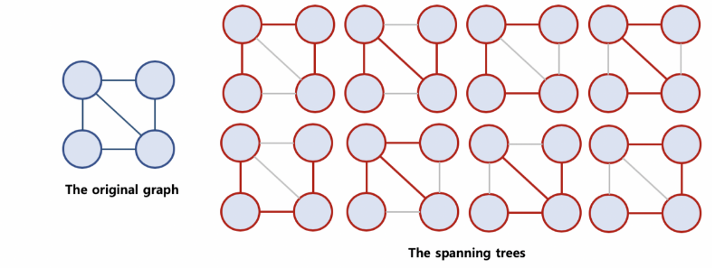

# MST(Minimum Spanning Tree, 최소 신장 트리)

## 1. Spanning Tree



### 1) 정의 및 조건

**모든 노드가 최소 개수의 간선으로 연결**된 그래프

- **최소 연결 = 노드와 연결된 간선의 수가 가장 작다.** 즉, cycle이 있어서는 안된다.
- **N개의 노드를 가지는 그래프의 최소 간선의 수는 N-1개이다.** 
- N개의 노드가 N-1 개의 간선으로 모두 연결되어 있다면, Spanning Tree라고 할 수 있다.


### 2) 특징

- 하나의 그래프(tree)에 하나 이상의 신장 트리가 존재할 수 있다.
- Cycle이 있어서는 안된다.

**※ 한 붓 그리기와는 다르다.**


### 3) 구현 방법

- DFS 혹은 BFS를 이용하여 그래프에서 신장 트리를 찾을 수 있다.

```
< BFS >
1. 랜덤으로 노드 하나 선택하여 큐에 넣기

2. 큐에서 노드를 빼서, visited 표시하고 해당 노드와 연결된 노드들을 확인한다.
	2-1. 노드가 이미 방문하였다면 버린다.
	2-2. 노드가 아직 방문하지 않았다면, 큐에 넣는다.

=> 노드에 방문 표시를 한다 -> 해당 회차에서의 간선을 선택했다.
=> 방문 표시를 하는 것은 cycle을 포함하는 것을 막기 위해서이다.
```


## 2. MST, Minimum Spanning Tree

### 1) 정의

- **Spanning Tree 중에서 가장 cost가 적게 드는 spanning tree**


### 2) 구현 방법

#### 🛠 Prim 방법

- 일반 Spanning Tree 구하는 방법에서 큐를 minheap으로 바꿔주기만 하면 된다.
  - **노드를 뽑을 때마다, 최소 비용의 간선에 연결된 노드를 뽑게 되어 최소 cost를 만족시키게 된다.**

```
< BFS with minheap >
1. 랜덤으로 노드 하나 선택하여 minheap에 노드와 cost 함께 넣기

2. heap에서 노드를 빼서, visited 표시하고 해당 노드와 연결된 노드들을 확인한다.
	2-1. 노드가 이미 방문하였다면 버린다.
	2-2. 노드가 아직 방문하지 않았다면, heap에 넣는다.
	
2번을 heap이 다 비워지거나, visited가 모두 1로 채워질 때까지 반복한다.
```


### 3) 사용 사례

- 도로 건설: 도시들을 모두 연결하면서 도로의 길이가 최소가 되도록 하는 문제